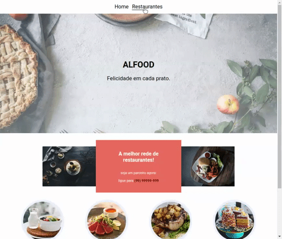
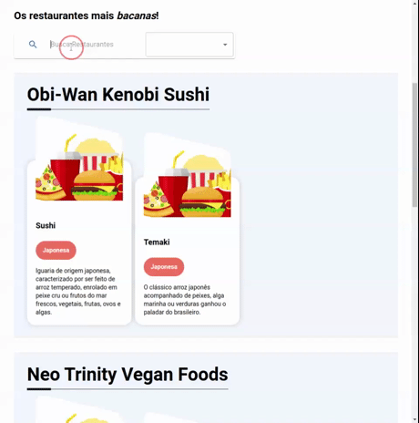
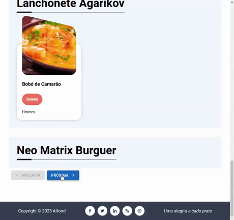
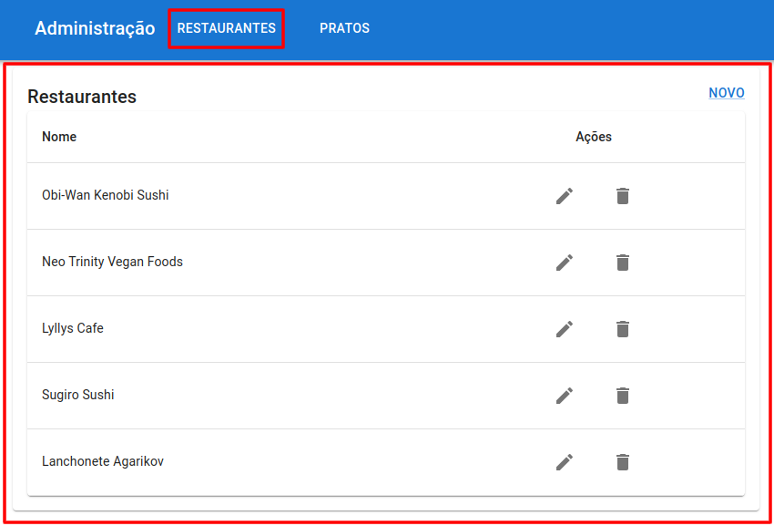
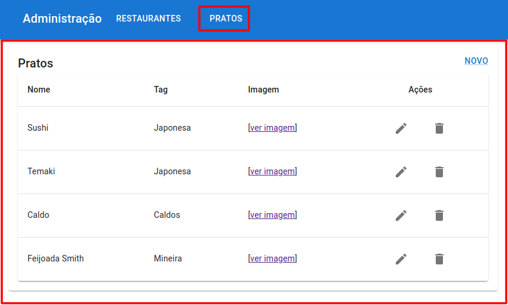
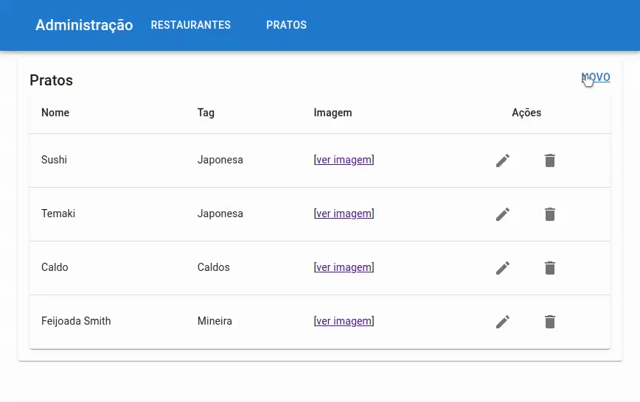
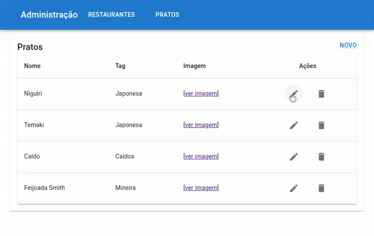
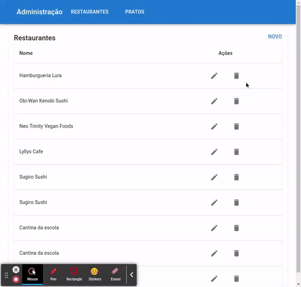

# Integrando uma API ao React
Este projeto foi criado para estudo sobre integração de API a uma aplicação React.

## Sobre o projeto
Além de dar _vida ao site "Alfood", que era estático e agora é dinâmico_! foi também desenvolvido um mini [CMS](https://pt.wikipedia.org/wiki/Sistema_de_gerenciamento_de_conte%C3%BAdo) para possibilitar a administração do conteúdo da aplicação.

### Tecnologias usadas
- **biblioteca [MUI](https://mui.com/)** para a criação da página de administração da aplicação.
- **[axios]()** na realização de requisições à API


### Instalação
Subindo a API
```
cd ./api && docker compose build && docker compose up
```

Subindo a Aplicação
```
cd ./client && npm start
```

> ***documentação da API** em http://localhost:8000/

> ***rota principal do site** em http://localhost:3000/

> ***rota administrativa em** http://localhost:3000/admin


### Funcionalidades
#### Integração de API ao site
Listagem dinâmica de restaurantes
<p>
	
</p>

Busca com ordenação de resultados de restaurantes
<p>
	
</p>

Páginação e botões de navegação entre as páginas.
<p>
	
</p>

#### Área administrativa para:

Administração de pratos e restaurantes
<div style="display: block">
	<p >
		
		
	</p>
</div>

Inclusão de novo prato e restaurante
<p>
	
</p>

Ediçao de restaurantes e pratos
<p>
	
</p>

Exclusão de restaurante e pratos com confirmação
<p>
	
</p>


### Explorado
#### Uso de compomentes do MUI
	
- **[Select](https://mui.com/material-ui/react-select/) e FormControl** 
		- para selecionar tags no formulário administrativo de pratos e restaurantes
		- e selecionar a ordenação desejada na busca de restaurantes

- **[Button](https://mui.com/material-ui/react-button/)** e icones auxiliando nos redirecionamento, envio de formulário entre outras ações.

- **[Link](https://mui.com/material-ui/react-link/)** na navegação entre páginas.

- **[Table](https://mui.com/material-ui/react-table/)** e seus companheiros para organizar a listagem de restaurantes e pratos.

- **[Grid](https://mui.com/material-ui/react-grid/)** para criar um cabeçalho na lista de pratos e restaurantes da área administrativa.

- **[Typography](https://mui.com/material-ui/react-typography/)** para lidar com os títulos.

- **[Dialog](https://mui.com/material-ui/react-dialog/)** e etc possiblitando a confirmação antes da remoção de pratos e restaurantes.


#### React
- **[Routes](https://reactrouter.com/en/main/components/routes)** para aninhar rotas com o mesmo _location_ '/admin'.

- **[Outlet](https://reactrouter.com/en/main/components/outlet)** para adicionar conteúdo html em um layout centralizado, de maneira a organizar o código .

- **[useEffect](https://react.dev/reference/react/useEffect)** hook react que executa algo (no caso a chamada da API) imediatamente quando o componente é montado:
    
    Aceita uma função callback e uma lista de dependências:
	1. executa a função toda vez que os valores das dependências é alterada.
	2. quando a lista é passada vazia executa o código apenas uma única vez.
		
- **[useNavigate](https://reactrouter.com/en/main/hooks/use-navigate)** hook react usando no redirecionamento das páginas.

- **[useState](https://react.dev/reference/react/useState)** hook react para atualizar o estado local (variáveis).

- Upload de arquivos com o elemento **input**.

- Envio via formulário de arquivos binários para API.

- Tratamento dos dados de arquivos de imagem (binários) através da classe **[FormData](https://developer.mozilla.org/en-US/docs/Web/API/FormData)** do JavaScript.

